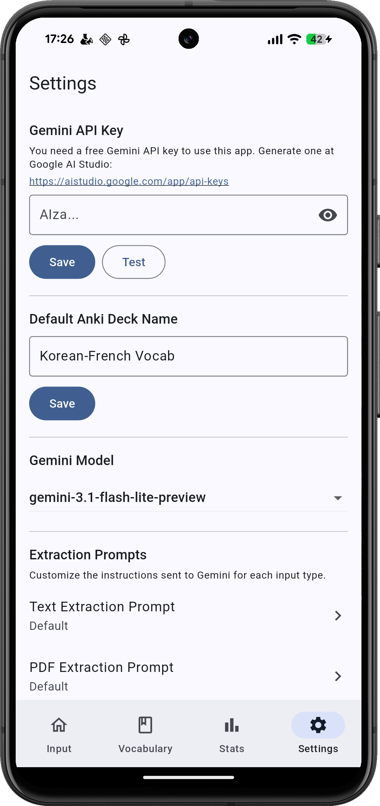
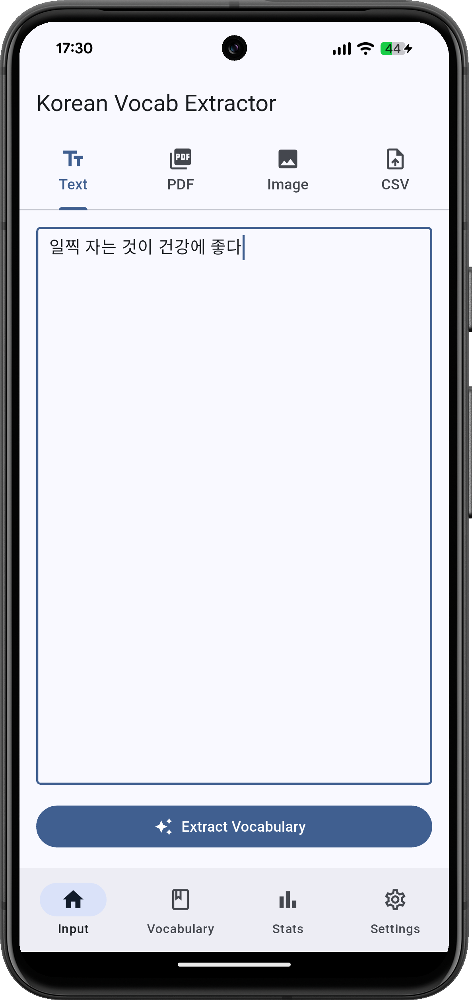
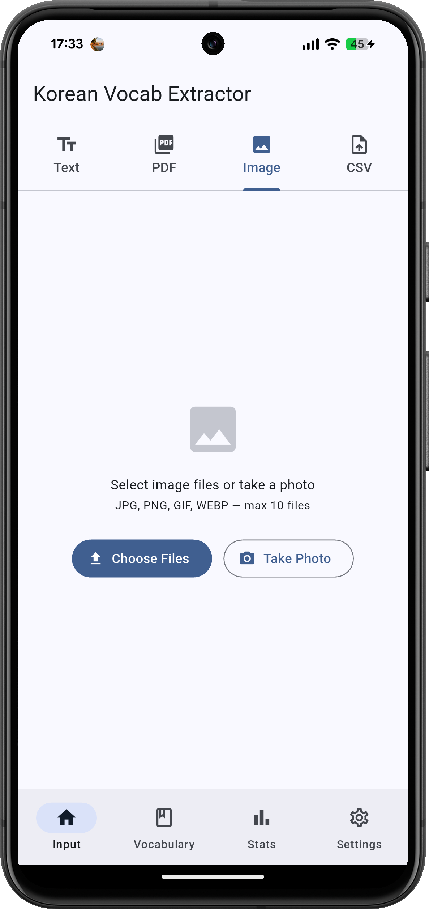
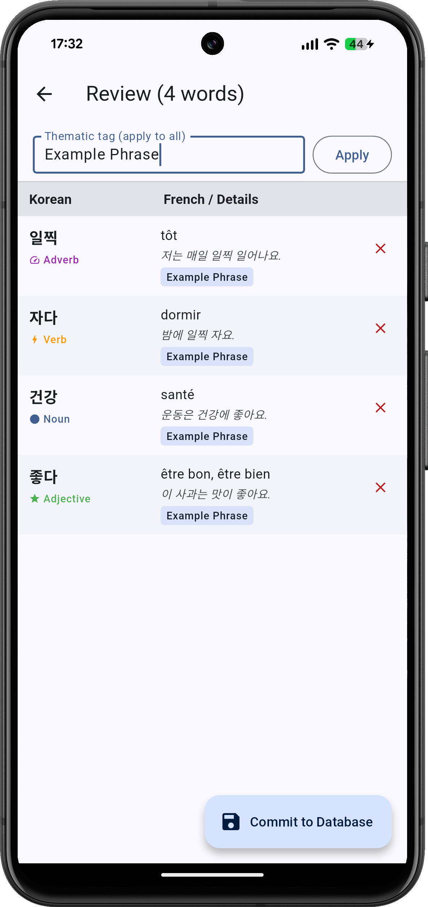
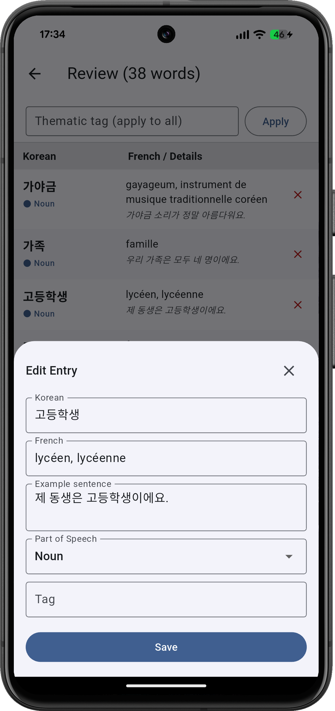
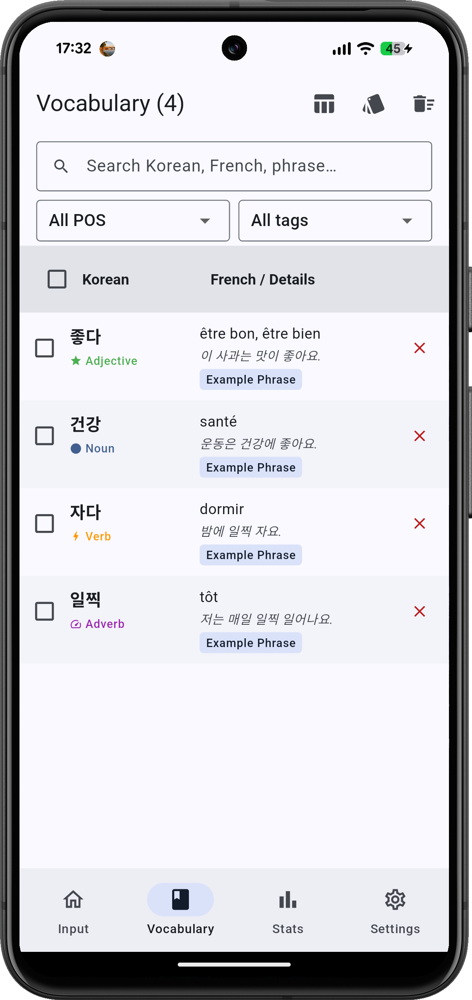

# Korean Vocabulary Extractor

An Android app that uses Google Gemini AI to extract Korean vocabulary from text, PDFs, and images, then exports it as Anki flashcard decks.

## Download

Get the latest APK from the [**Releases**](../../releases/latest) page.

> **Requires Android 7.0 (API 24) or higher.**

## Features

- **AI-powered extraction** — paste text or upload PDF/image files; Gemini identifies Korean words automatically
- **Anki export** — generates `.apkg` files ready to import into Anki, including Korean, romanization, French translation, and part of speech
- **Vocabulary history** — SQLite-backed log of all extracted words with search and filtering
- **Batch processing** — process up to 10 files at a time
- **Configurable models** — choose between Gemini Flash and Pro variants
- **Secure key storage** — API key stored via Android Keystore, never hard-coded

## How to Use

### Step 1 — Add your Gemini API key (required first step)

Go to the **Settings** tab and paste your Gemini API key. You can get a free key at [Google AI Studio](https://aistudio.google.com/app/api-keys). Tap **Save**, then **Test** to verify it works. You can also set your default Anki deck name and choose the Gemini model here.

  

---

### Step 2 — Import text or an image

Switch to the **Input** tab. Choose your source:

- **Text** — paste any Korean text directly into the field and tap **Extract Vocabulary**.
- **Image** — switch to the Image tab, tap **Choose Files** or **Take Photo** to import a screenshot or photo containing Korean.
- **PDF** — switch to the PDF tab and select up to 10 PDF pages.

  
  &nbsp;&nbsp;
  

---

### Step 3 — Review extracted vocabulary

After extraction, the **Review** screen lists every word Gemini found, with its French translation, an example sentence, and part of speech. Before saving you can:

- Remove any word you don't want by tapping the **×** button.
- Apply a **thematic tag** to all entries at once (e.g. "Chapter 3", "Drama vocab").
- Tap any row to open the **Edit Entry** dialog and correct the Korean, French translation, example sentence, POS, or tag.

Once satisfied, tap **Commit to Database** to save everything.

  
  &nbsp;&nbsp;
  

---

### Step 4 — Browse and export your vocabulary

The **Vocabulary** tab shows your full word list. You can:

- **Search** by Korean word, French translation, or example phrase.
- **Filter** by part of speech or tag.
- **Select** words and export them as an Anki `.apkg` deck or a CSV file.

  

---

## Supported Input Types

| Type | Details |
|---|---|
| Plain text | Paste any Korean text directly |
| PDF | Up to 10 pages per file |
| Images | JPEG, PNG screenshots of Korean content |

## Release Notes

### V0.4 — 2026-04-11

- **TOPIK Milestone gauges** — green for TOPIK I (800 words) and purple for TOPIK II (3 500 words)
- **Learning Velocity** — daily average over the last 30 days and weekly bar chart
- **Source Analysis** — donut chart breaking down vocabulary by import source (Text · PDF · Image · CSV)
- **Import session tracking** — every extraction records an entry with correct source attribution

### V0.3 Beta — 2026-04-10

- **Custom extraction prompts** — edit the prompts sent to Gemini for Text, PDF, and Image modes
- **Prompt reset** — restore built-in defaults instantly

### V0.2 Beta — 2026-04-09

- **CSV import preview** — inspect and edit cards before saving
- **Custom export filenames**
- **Select all vocabulary**
- **Smart duplicate detection**

### V0.1 — Initial Release

- AI-powered Korean vocabulary extraction from text, PDF, and images via Gemini API
- Anki `.apkg` export
- SQLite vocabulary history
- Secure API key storage

## License

MIT
